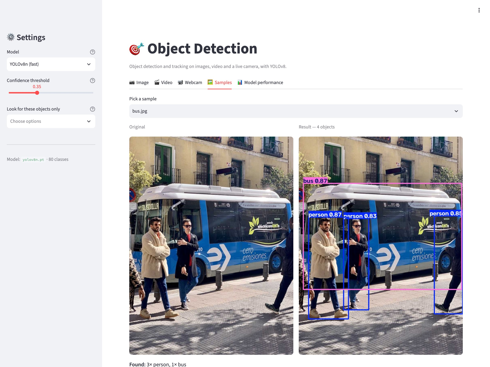
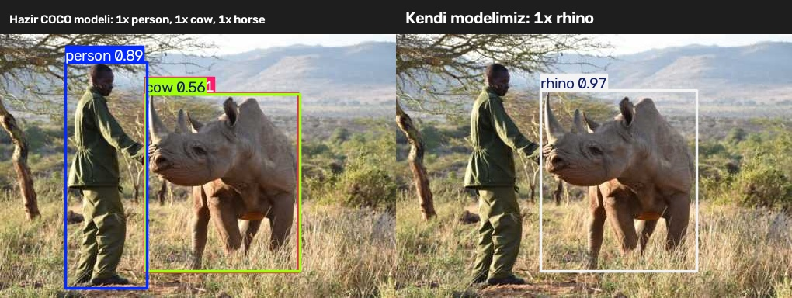
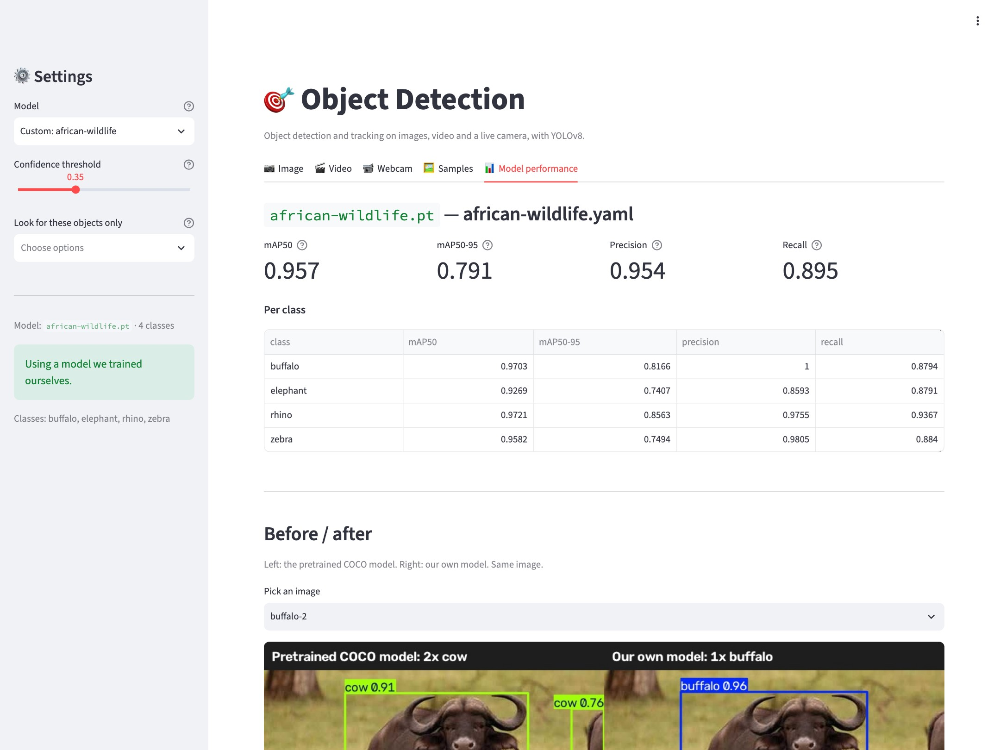
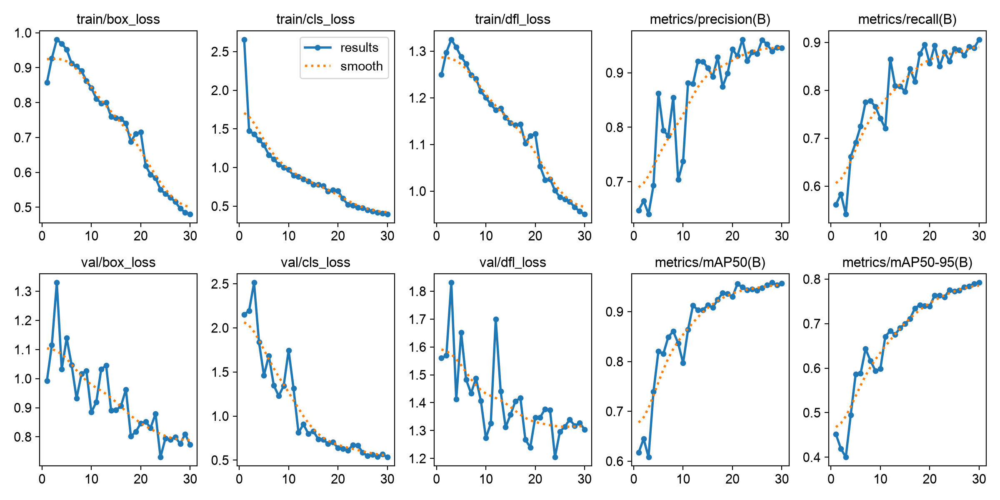
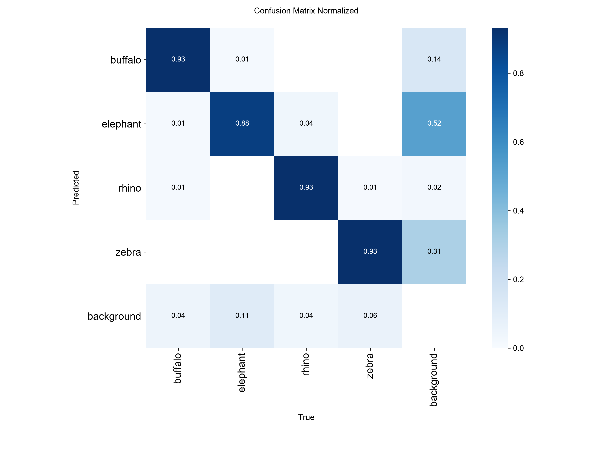

# 🎯 Object Detection

*[Türkçe README](README.tr.md)*

[](https://github.com/knkrc/Object-Detection/actions/workflows/ci.yml)
[](https://www.python.org/)
[](LICENSE)
[](Dockerfile)
> 🚀 *Live demo: deploy on [Streamlit Community Cloud](https://share.streamlit.io)
> and put the link here.*

A Streamlit app for **object detection and tracking** on images, video and a live
camera, built on YOLOv8. The pretrained COCO model recognises **80 object classes** —
people, cars, dogs, handbags and so on. Tracking mode assigns each object a
persistent ID, which answers the question detection alone cannot: *how many
distinct cars passed through this video?*


*Detection on a sample image → filtering to one class (the bus box disappears) →
model performance metrics → switching to our fine-tuned model → before/after comparison.*

---

## What it does

| Feature | Description |
|---|---|
| 📷 **Image** | Upload a JPG/PNG, see detections drawn as boxes, download the result |
| 🎬 **Video** | Upload an MP4, process it frame by frame, download the annotated video |
| 📹 **Webcam** | Live detection from your computer's camera |
| 🖼️ **Samples** | Try it in one click with images shipped in the repo |
| 🎯 **Tracking** | ByteTrack: persistent IDs, unique counts, line crossings, motion trails |
| 🧠 **Your own model** | A fine-tuned model, selectable in the sidebar under "Custom:" |
| 📊 **Performance** | mAP tables, training curves, before/after comparison |
| ⚙️ **Settings** | Model size (n/s/m), confidence threshold, class filter |



### What tracking mode adds

Turning on **tracking mode** in the Video and Webcam tabs gives you:

- **Unique counts** — "3 people, 1 bus", without counting the same object twice
- **Line crossing counts** — drop a virtual line on the frame and count what
  crosses it, with direction (`down`/`up` for a horizontal line, `right`/`left`
  for a vertical one)
- **Motion trails** — each object's path over the last N frames, in a colour
  derived from its ID
- **Time on screen** — how long each ID stayed visible, downloadable as CSV

## Installation

```bash
git clone <repo-url>
cd Object-Detection

python -m venv .venv
source .venv/bin/activate        # Windows: .venv\Scripts\activate
pip install -r requirements.txt

python scripts/download_samples.py   # fetch the sample images (optional)
```

## Running it

```bash
streamlit run app.py
```

This opens `http://localhost:8501`. On the first run the model weights (~6 MB)
are downloaded automatically and stored in `models/`.

---

## Our own model — African Wildlife

The pretrained COCO model knows 80 classes, but buffalo and rhino are not among
them: it calls a rhino a "cow", and a buffalo a "cow" too. We fine-tuned that
same model on a 1,500-image dataset to recognise four African animals.



*Left: the pretrained COCO model (`cow 0.56`, plus a phantom `horse`).
Right: our model (`rhino 0.97`).*

### Results

YOLOv8n, 30 epochs, 640px — **31 minutes** on a MacBook using MPS.
Validation set: 225 images, 379 instances.

| Metric | Value |
|---|---|
| **mAP50** | **0.957** |
| mAP50-95 | 0.791 |
| Precision | 0.954 |
| Recall | 0.895 |

| Class | mAP50 | mAP50-95 | Precision | Recall |
|---|---|---|---|---|
| buffalo | 0.970 | 0.817 | 1.000 | 0.879 |
| elephant | 0.927 | 0.741 | 0.859 | 0.879 |
| rhino | 0.972 | 0.856 | 0.976 | 0.937 |
| zebra | 0.958 | 0.749 | 0.981 | 0.884 |

The metrics and the before/after comparison also live inside the app:



<details>
<summary>Training curves</summary>




</details>

The trained model is committed to the repo (`models/african-wildlife.pt`, 5.9 MB) —
clone it and pick **"Custom: african-wildlife"** in the sidebar to try it right away.

### Training your own

```bash
python scripts/train.py --epochs 30        # train (saves to models/<name>.pt)
python scripts/evaluate.py                 # measure, write docs/metrics.*
python scripts/compare.py                  # generate before/after images
```

With your own dataset:

```bash
python scripts/train.py --data path/to/data.yaml --model yolov8s.pt --epochs 50
```

To train on a GPU, use [`notebooks/train_colab.ipynb`](notebooks/train_colab.ipynb) —
the same run takes minutes on Colab's free T4. Drop the resulting `best.pt` into
`models/` and the app will pick it up on its own.

## Project layout

```
Object-Detection/
├── app.py                      # Streamlit UI (all tabs)
├── src/
│   ├── config.py               # paths, model list, defaults
│   ├── detector.py             # YOLO wrapper — detect() lives here
│   ├── tracker.py              # tracking session, line counter, trails
│   └── video.py                # frame-by-frame video processing
├── scripts/
│   ├── download_samples.py     # fetch sample images
│   ├── train.py                # fine-tuning
│   ├── evaluate.py             # metrics → docs/
│   ├── compare.py              # before/after images
│   ├── screenshot.py           # README screenshots
│   └── make_demo_gif.py        # README demo GIF
├── notebooks/
│   └── train_colab.ipynb       # training on a GPU
├── tests/                      # pytest suite (fast / slow split)
├── deploy/                     # HF Spaces README and push script
├── Dockerfile, docker-compose.yml
├── docs/                       # metrics, plots, comparisons
├── samples/                    # sample images
├── models/                     # weights (gitignored, except our own model)
├── datasets/, runs/            # datasets and training output (gitignored)
├── outputs/                    # processed videos (gitignored)
├── requirements.txt            # plus requirements-dev.txt (pytest, ruff)
├── pyproject.toml              # pytest and ruff configuration
└── CLAUDE.md                   # development log / roadmap
```

## How it works

1. The `Detector` class loads ultralytics' `YOLO` model and keeps it in memory
   (Streamlit loads it once via `@st.cache_resource`).
2. The uploaded image is decoded with OpenCV into a BGR numpy array.
3. Model output comes back as both an annotated image and a list of
   `Detection(label, confidence, box)` — the UI uses both.
4. Every video frame goes through the same path, with a "frame skip" setting to
   trade accuracy for speed. `process_video` does not know what work is being
   done: it calls the `on_frame` function it was handed, so the same loop serves
   both detection and tracking.
5. In tracking, `TrackSession` holds one session's state (IDs, trails, counters).
   A line crossing is detected when the sign of the cross product — which side of
   the line the object's centre is on — flips between frames.

---

## Tests

```bash
pip install -r requirements-dev.txt

pytest                    # everything (65 tests)
pytest -m "not slow"      # fast ones only — no model needed, ~1 s
pytest -m slow            # the ones that download and run the real model
```

Tests come in two groups. The fast ones use a fake model layer
(`tests/conftest.py`), so the tracking logic — counting, durations, trails, line
crossings — can be tested in milliseconds without touching torch. The ones marked
`slow` run the real weights and are skipped in CI.

Coverage of `src/` from the fast tests alone is **93%** (`tracker` 98%, `video` 95%,
`config` 100%). `detector` sits lower because its model-dependent parts are only
exercised by the `slow` tests.

**CI** runs on every push and pull request: ruff (lint + format) and the fast test
suite on Python 3.11 / 3.12 / 3.13. See [`.github/workflows/ci.yml`](.github/workflows/ci.yml).

---

## Running with Docker

```bash
docker compose up --build
```

Then open `http://localhost:8501`. Or directly:

```bash
docker build -t object-detection .
```

```bash
docker run -p 8501:8501 object-detection
```

The image (~2.2 GB) is self-contained: model weights (pretrained YOLOv8n plus our
African Wildlife model), sample images and metrics are all baked in, so nothing is
downloaded on first start. torch is installed from the CPU index — the PyPI build
pulls CUDA packages on Linux (~2.5 GB).

The container runs as a non-root user (uid 1000), which is both good practice and
a Hugging Face Spaces requirement.

## Publishing a live demo

### Streamlit Community Cloud

The app is a Streamlit app, so its natural home needs no extra configuration:

1. Sign in at [share.streamlit.io](https://share.streamlit.io) with GitHub
2. **Create app** → pick this repository, branch `main`, main file `app.py`
3. Deploy

The platform reads [`requirements.txt`](requirements.txt) and
[`packages.txt`](packages.txt) from the repo root. `requirements.txt` pins the
`+cpu` torch build on Linux — the PyPI wheel drags in CUDA packages a free tier
cannot afford — while macOS keeps the ordinary wheel through a platform marker.
`packages.txt` carries the two apt packages opencv needs.

### Hugging Face Spaces

[`deploy/push_to_hf.sh`](deploy/push_to_hf.sh) also works — it clones the Space,
copies only what the app needs (training scripts, tests and datasets are left
out) and pushes:

```bash
export HF_TOKEN=hf_...
./deploy/push_to_hf.sh <your-username>/<space-name>
```

One caveat that cost us an afternoon: HF offers Docker Spaces only on a paid
plan, and its Space creation form no longer lists Streamlit, so it defaults to
Gradio with **ZeroGPU** hardware. ZeroGPU works only with the Gradio SDK, and a
free account cannot switch a Space down to CPU basic afterwards. Create the
Space with CPU basic hardware from the start, or the build stops at
`CONFIG_ERROR`.

### Why there is no webcam tab on the server

The webcam tab uses `cv2.VideoCapture(0)`, which opens the camera of **whichever
machine the app is running on**. Locally that is your camera; on a server it would
be the server's camera rather than the visitor's — useless either way. So when
`DEPLOYED=1` (or HF's own `SPACE_ID`) is set, that tab is never created. It keeps
working locally.

## Roadmap

- [x] **M1** — Working app with image, video, webcam and sample tabs
- [x] **M2** — Object tracking: ByteTrack, unique counts, line crossings, trails
- [x] **M3** — Fine-tuning on a custom dataset: African Wildlife, mAP50 0.957
- [x] **M4** — Tests (65 tests, 93% coverage) + GitHub Actions CI
- [x] **M5** — Docker image + Hugging Face Spaces deployment pipeline

See [CLAUDE.md](CLAUDE.md) for details and notes from each milestone.

## Notes

- Runs on CPU; ultralytics uses a GPU automatically if one is available.
- Tracking needs the `lap` package (it is in `requirements.txt`); without it
  ultralytics tries to install it itself but then asks for a restart.
- The webcam tab asks for camera permission on macOS; you may need to restart your
  terminal after granting it.
- The project is in English throughout — interface, comments, tests,
  infrastructure files and `CLAUDE.md`. `README.tr.md` is the one exception, kept
  as a Turkish translation of this page.
- Sample images are [Ultralytics'](https://ultralytics.com) public demo images.

## License

MIT
