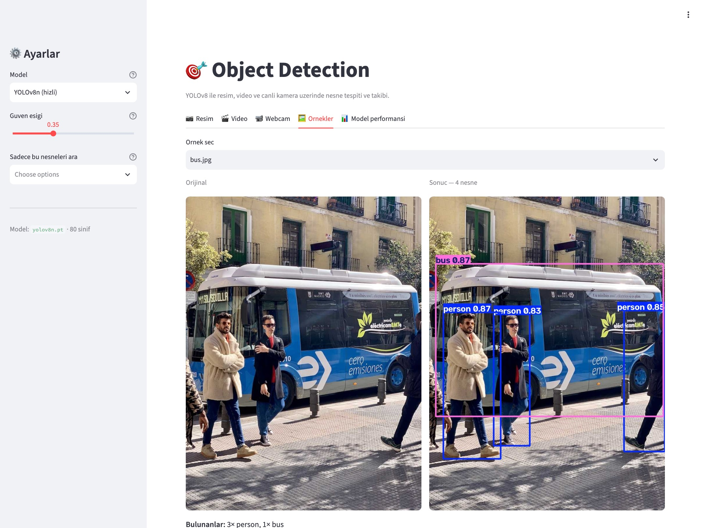
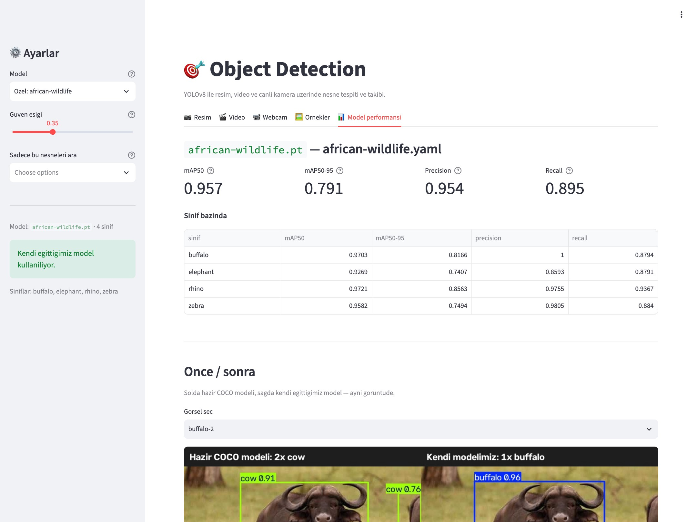

# 🎯 Object Detection

*[English README](README.md)*

[](https://github.com/knkrc/Object-Detection/actions/workflows/ci.yml)
[](https://www.python.org/)
[](LICENSE)
[](Dockerfile)

> 🚀 *Canlı demo: Hugging Face Space'ini açtıktan sonra linkini buraya ekle —
> `./deploy/push_to_hf.sh <kullanıcı-adın>/<space-adı>`*

YOLOv8 ile resim, video ve canlı kamera üzerinde **nesne tespiti ve takibi** yapan Streamlit uygulaması.
COCO veri setiyle eğitilmiş hazır model sayesinde insan, araba, köpek, çanta gibi **80 farklı nesneyi** tanır.
Takip modu her nesneye kalıcı bir ID vererek "bu videodan toplam kaç farklı araba geçti" sorusunu cevaplar.


*Örnek görselde tespit → sınıf filtresi (otobüs kutusu kayboluyor) → kendi
eğittiğimiz modele geçiş → model performansı ve önce/sonra karşılaştırması.*

---

## Neler yapabiliyor?

| Özellik | Açıklama |
|---|---|
| 📷 **Resim** | JPG/PNG yükle, tespit edilen nesneleri kutularla gör, sonucu indir |
| 🎬 **Video** | MP4 yükle, kare kare işle, işlenmiş videoyu indir |
| 📹 **Webcam** | Bilgisayar kamerasından canlı tespit |
| 🖼️ **Örnekler** | Repoda hazır gelen görsellerle tek tıkla dene |
| 🎯 **Takip** | ByteTrack ile kalıcı ID, benzersiz sayım, çizgi geçişi, hareket izi |
| 🧠 **Kendi modelin** | Fine-tune edilmiş model, arayüzde "Özel:" olarak seçilebilir |
| 📊 **Performans** | mAP tablosu, eğitim grafikleri, önce/sonra karşılaştırması |
| ⚙️ **Ayarlar** | Model boyutu (n/s/m), güven eşiği ve sınıf filtresi |



### Takip modu neler veriyor?

Video ve Webcam sekmelerindeki **Takip modu** anahtarı açıldığında:

- **Benzersiz sayım** — aynı nesneyi iki kez saymadan "3 farklı insan, 1 otobüs"
- **Çizgi geçiş sayımı** — ekrana sanal bir çizgi koy, geçenleri yönüyle say
  (yatay çizgide `aşağı`/`yukarı`, dikey çizgide `sağa`/`sola`)
- **Hareket izi** — her nesnenin son N karedeki yolu, ID'ye özel renkte
- **Nesne başına süre** — hangi ID kaç saniye ekranda kaldı; CSV olarak indirilebilir

## Kurulum

```bash
git clone <repo-url>
cd Object-Detection

python -m venv .venv
source .venv/bin/activate        # Windows: .venv\Scripts\activate
pip install -r requirements.txt

python scripts/download_samples.py   # örnek görselleri indir (opsiyonel)
```

## Çalıştırma

```bash
streamlit run app.py
```

Tarayıcıda `http://localhost:8501` açılır. İlk çalıştırmada model ağırlığı (~6 MB)
otomatik olarak indirilip `models/` klasörüne kaydedilir.

---

## Kendi modelimiz — African Wildlife

Hazır COCO modeli 80 sınıf tanıyor ama bufalo ile gergedanı bilmiyor: gergedana
"inek", bufaloya "inek" diyor. Aynı modeli 1500 görsellik bir veri setiyle
fine-tune ederek 4 Afrika hayvanını tanıyan bir model eğittik.


*Solda hazır COCO modeli (`cow 0.56` + hayalet bir `horse`), sağda kendi modelimiz (`rhino 0.97`).*

### Sonuçlar

YOLOv8n, 30 epoch, 640px — MacBook'ta MPS ile **31 dakika**. Doğrulama seti: 225 görsel, 379 nesne.

| Metrik | Değer |
|---|---|
| **mAP50** | **0.957** |
| mAP50-95 | 0.791 |
| Precision | 0.954 |
| Recall | 0.895 |

| Sınıf | mAP50 | mAP50-95 | Precision | Recall |
|---|---|---|---|---|
| buffalo | 0.970 | 0.817 | 1.000 | 0.879 |
| elephant | 0.927 | 0.741 | 0.859 | 0.879 |
| rhino | 0.972 | 0.856 | 0.976 | 0.937 |
| zebra | 0.958 | 0.749 | 0.981 | 0.884 |

Metrikler ve önce/sonra karşılaştırması uygulamanın içinde de duruyor:



<details>
<summary>Eğitim grafikleri</summary>


</details>

Eğitilmiş model repoda (`models/african-wildlife.pt`, 5.9 MB) — klonlayıp
arayüzde **"Özel: african-wildlife"** seçerek hemen deneyebilirsin.

### Kendin eğitmek istersen

```bash
python scripts/train.py --epochs 30        # eğit (models/<isim>.pt olarak kaydeder)
python scripts/evaluate.py                 # ölç, docs/metrics.* üret
python scripts/compare.py                  # önce/sonra görselleri üret
```

Kendi veri setinle:

```bash
python scripts/train.py --data yol/data.yaml --model yolov8s.pt --epochs 50
```

GPU'da eğitmek için [`notebooks/train_colab.ipynb`](notebooks/train_colab.ipynb) —
Colab'ın ücretsiz T4'ünde aynı eğitim dakikalar sürer. İnen `best.pt` dosyasını
`models/` klasörüne koyman yeterli; arayüz onu otomatik bulur.

## Proje yapısı

```
Object-Detection/
├── app.py                      # Streamlit arayüzü (tüm sekmeler)
├── src/
│   ├── config.py               # yollar, model listesi, varsayılan ayarlar
│   ├── detector.py             # YOLO sarmalayıcı — detect() burada
│   ├── tracker.py              # takip oturumu, çizgi sayacı, izler
│   └── video.py                # video dosyasını kare kare işleme
├── scripts/
│   ├── download_samples.py     # örnek görselleri indirir
│   ├── train.py                # fine-tune
│   ├── evaluate.py             # metrikler → docs/
│   ├── compare.py              # önce/sonra görselleri
│   ├── screenshot.py           # README ekran görüntüleri
│   └── make_demo_gif.py        # README demo GIF'i
├── notebooks/
│   └── train_colab.ipynb       # GPU'da eğitim
├── tests/                      # pytest paketi (hızlı + slow ayrımı)
├── deploy/                     # HF Spaces README'si ve push scripti
├── Dockerfile, docker-compose.yml
├── docs/                       # metrikler, grafikler, karşılaştırmalar
├── samples/                    # örnek görseller
├── models/                     # ağırlıklar (kendi modelimiz hariç git'e girmez)
├── datasets/, runs/            # veri seti ve eğitim çıktıları (git'e girmez)
├── outputs/                    # işlenmiş videolar (git'e girmez)
├── requirements.txt            # + requirements-dev.txt (pytest, ruff)
├── pyproject.toml              # pytest ve ruff yapılandırması
└── CLAUDE.md                   # geliştirme günlüğü / yol haritası
```

## Nasıl çalışıyor?

1. `Detector` sınıfı ultralytics'in `YOLO` modelini yükler ve bellekte tutar
   (Streamlit'te `@st.cache_resource` ile bir kez yüklenir).
2. Yüklenen resim OpenCV ile BGR bir numpy dizisine çevrilir.
3. Model çıktısı hem çizilmiş görsel hem de `Detection(label, confidence, box)`
   listesi olarak döner — arayüz ikisini de kullanır.
4. Videoda her kare aynı yoldan geçer; "kare atlama" ayarı ile hız/doğruluk
   dengesi kurulabilir. `process_video` işin ne olduğunu bilmez — kendisine
   verilen `on_frame` fonksiyonunu çağırır, böylece aynı döngü hem tespit hem
   takip için kullanılır.
5. Takipte `TrackSession` bir oturumun durumunu (ID'ler, izler, sayaçlar) tutar.
   Çizgi geçişi, nesne merkezinin çizgiye göre hangi tarafta olduğunun
   (vektörel çarpımın işareti) kareler arasında değişmesiyle tespit edilir.

---

## Testler

```bash
pip install -r requirements-dev.txt

pytest                    # hepsi (65 test)
pytest -m "not slow"      # sadece hızlı olanlar — model gerektirmez, ~1 sn
pytest -m slow            # gerçek modeli indirip çalıştıranlar
```

Testler iki gruba ayrılıyor. Hızlı olanlar sahte bir model katmanı kullanıyor
(`tests/conftest.py`), böylece takip mantığı — sayım, süre, iz, çizgi geçişi —
torch'a hiç dokunmadan milisaniyeler içinde test edilebiliyor. `slow` işaretli
olanlar gerçek ağırlıkları indirip çalıştırıyor ve CI'da atlanıyor.

`src/` kapsamı hızlı testlerle **%93** (`tracker` %98, `video` %95, `config` %100). `detector`
düşük görünüyor çünkü model gerektiren kısımları yalnızca `slow` testler kapsıyor.

**CI** her push ve PR'da çalışıyor: ruff (lint + format) ve Python 3.11 / 3.12 / 3.13
üzerinde hızlı test paketi. Bkz. [`.github/workflows/ci.yml`](.github/workflows/ci.yml).

---

## Docker ile çalıştırma

```bash
docker compose up --build
```

Sonra `http://localhost:8501`. Ya da doğrudan:

```bash
docker build -t object-detection .
```

```bash
docker run -p 8501:8501 object-detection
```

İmaj (~2.2 GB) kendi kendine yeter: model ağırlıkları (hazır YOLOv8n +
eğittiğimiz African Wildlife modeli), örnek görseller ve metrikler gömülü
geliyor, ilk açılışta hiçbir şey indirilmiyor. torch CPU deposundan kuruluyor — PyPI sürümü
Linux'ta CUDA paketlerini de çekiyor (~2.5 GB).

Konteyner root olmayan bir kullanıcı (uid 1000) altında çalışıyor; bu hem iyi
bir pratik hem de Hugging Face Spaces'in gereği.

## Canlı demo yayınlama

Hugging Face Spaces'e göndermek için:

1. [huggingface.co](https://huggingface.co)'da hesap aç ve **Docker** SDK'sıyla
   bir Space oluştur
2. [Write yetkili bir token](https://huggingface.co/settings/tokens) üret
3. Gönder:

```bash
export HF_TOKEN=hf_...
./deploy/push_to_hf.sh <kullanıcı-adın>/<space-adı>
```

Script Space'i klonluyor, uygulamanın çalışması için gereken dosyaları kopyalıyor
(eğitim scriptleri, testler ve veri setleri gitmiyor), Space'in kendi README'sini
[`deploy/space-README.md`](deploy/space-README.md)'den alıp push ediyor.

### Sunucuda webcam neden yok?

Webcam sekmesi `cv2.VideoCapture(0)` ile **uygulamanın çalıştığı makinenin**
kamerasını açıyor. Yerelde bu senin kameran; sunucuda ise ziyaretçinin değil
sunucunun kamerası olurdu — yani işe yaramaz. Bu yüzden `DEPLOYED=1` (veya HF'in
eklediği `SPACE_ID`) varken o sekme hiç oluşturulmuyor. Yerelde çalışmaya
devam ediyor.

## Yol haritası

- [x] **M1** — Resim, video, webcam ve örneklerle çalışan temel uygulama
- [x] **M2** — Nesne takibi: ByteTrack, benzersiz sayım, çizgi geçişi, hareket izi
- [x] **M3** — Kendi veri setiyle fine-tune: African Wildlife, mAP50 0.957
- [x] **M4** — Testler (65 test, %93 kapsam) + GitHub Actions CI
- [x] **M5** — Docker imajı + Hugging Face Spaces deploy hattı

Detaylar ve her milestone'un notları için [CLAUDE.md](CLAUDE.md).

## Notlar

- CPU'da çalışır; GPU varsa ultralytics otomatik kullanır.
- Takip için `lap` paketi gerekir (`requirements.txt`'de var); eksikse
  ultralytics kurulumu kendi başlatmaya çalışır ama yeniden başlatma ister.
- Webcam sekmesi macOS'ta kamera izni ister; izin verdikten sonra terminali
  yeniden başlatman gerekebilir.
- Örnek görseller [Ultralytics](https://ultralytics.com)'in herkese açık demo görselleridir.

## Lisans

MIT
